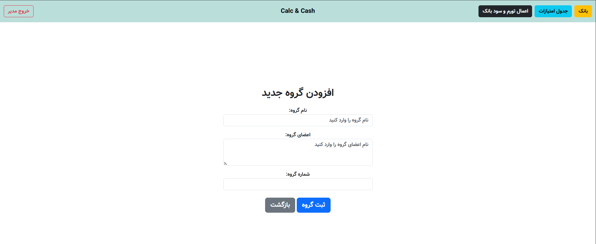
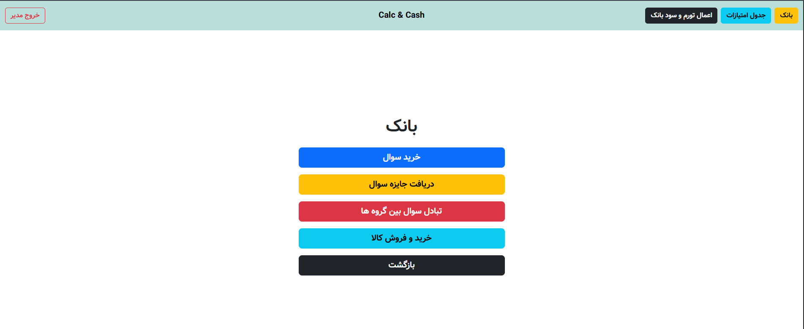
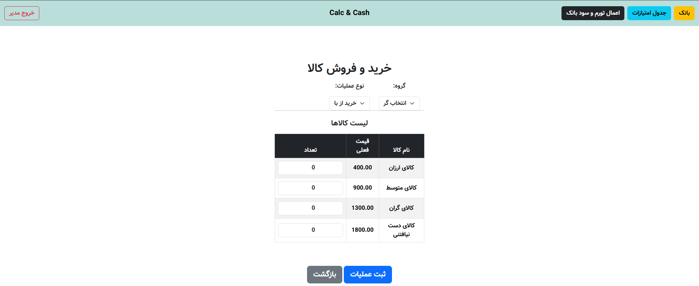
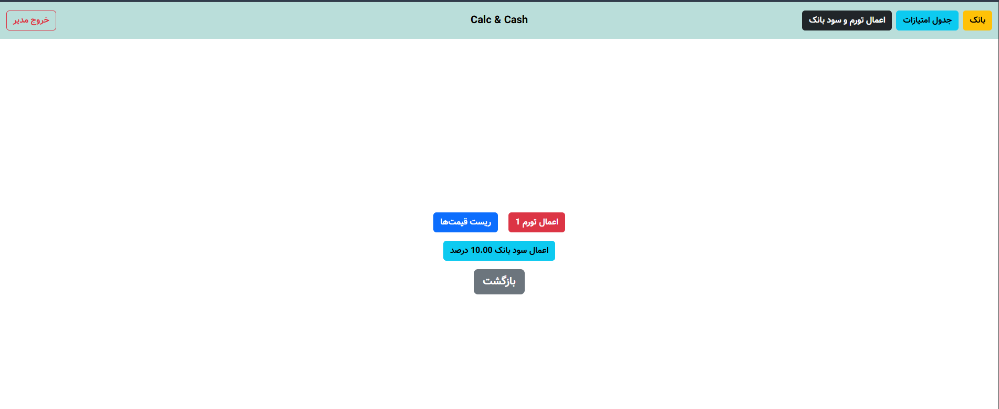
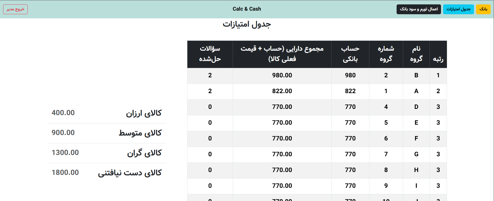

# Calc & Cash (accountancyApp)

A Django web app that streamlines scoring and in-game accounting for a math-city simulation competition.  
Players (teams) earn money by solving questions, trade questions with other groups and goods with the bank, and compete to finish with the highest total assets.

## Overview
**Calc & Cash** helps organizers run a classroom/competition where teams earn and spend virtual money.  
The app keeps the bank ledger, tracks solved questions, applies inflation and interest, and displays a live leaderboard.

> Built with **Django**, **PostgreSQL**, **HTML/CSS/JS**, and **Bootstrap**.

---

## Features

- **Question Bank & Rewards**
  - Three difficulty levels: Easy, Medium, Hard.
  - Manager defines quantity, purchase price, and reward per solved question.
  - Teams buy questions → solve → earn more money.

- **Goods Market**
  - Manager defines goods and their initial prices.
  - Teams can buy and sell goods with the bank.
  - Supports **inflation/deflation events** that change goods prices.

- **Bank & Score Calculation**
  - All transactions stored in PostgreSQL via Django ORM.
  - Manager controls **interest rate**.
  - Leaderboard ranks teams by **total assets** and **number of solved questions**.

- **Teams Management**
  - Create teams (each with a unique team ID).
  - Public scoreboard with current goods prices.

---

## Roles & Access

| Role     | Capabilities | Authentication |
|---------|-------------|----------------|
| Manager | Configure game rules, prices, rewards, inflation, interest | Shared passphrase |
| Banker  | Executes transactions | Shared passphrase |
| Teams   | Participate and play | No login needed |

> *Note:* A shared passphrase is used due to time constraints; middleware + decorators prevent unauthorized access.

---

## Screenshots

### Adding new group page


### Bank page


### Items page


### Inflation & Interest page


### Scoreboard


---

## Tech Stack

- **Backend:** Django (Python)
- **Database:** PostgreSQL
- **Frontend:** HTML, CSS, JavaScript, Bootstrap

---

## Installation

```bash
git clone https://github.com/Yasaman-Saffar/AccountancyApp.git
cd AccountancyApp
python -m venv .venv
source .venv/bin/activate  # or .venv\Scripts\activate on Windows
pip install -r requirements.txt
```


Create a PostgreSQL database:

```bash
CREATE DATABASE calc_cash;
CREATE USER calc_cash_user WITH PASSWORD 'change-me';
GRANT ALL PRIVILEGES ON DATABASE calc_cash TO calc_cash_user;
```


Create .env in project root:

```bash
DJANGO_SECRET_KEY=change-me
DB_NAME=calc_cash
DB_USER=calc_cash_user
DB_PASSWORD=change-me
DB_HOST=127.0.0.1
DB_PORT=5432
STAFF_PASSPHRASE=change-me
```


Apply migrations:

```bash
python manage.py migrate
```

Run:

```bash
python manage.py runserver
```

## Project Background

This project was developed voluntarily for a student scientific association to support a math-city simulation competition.
